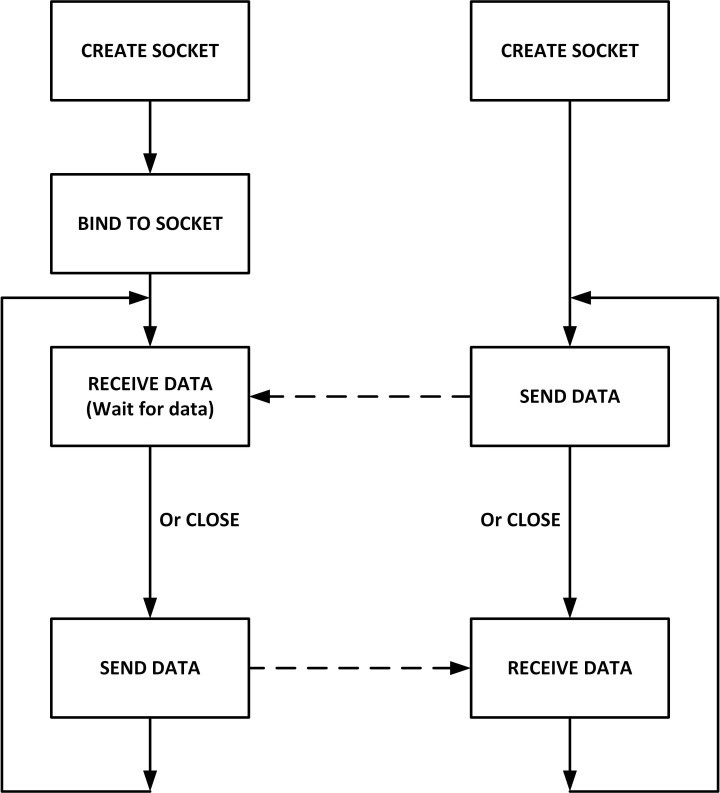

# Client and Server Program using both TCP and UDP

## Installation

### TCP Client Server Program

* **Step 1**: Complie The Program
  ```bash
  gcc tcpServer.c -o tcpServer 
  gcc tcpClient.c -o tcpClient 
  ```
* **Step 2**: Run the Program
  ```bash
  ./tcpServer
  ./tcpClient # run it in another terminal window
  ```

### UDP Client Server Program

* **Step 1**: Complie The Program

  ```bash
  gcc udpServer.c -o udpServer 
  gcc udpClient.c -o udpClient 
  ```
* **Step 2**: Run the Program

  ```bash
  ./udpServer 5566 # send the port number also
  ./udpClient 5566 # run it in another terminal window
  ```

## What is Socket Programming?

Socket programming is a way to connect two nodes on a network to communicate with each other. It uses socket APIs to establish communication links between local and remote processes. Sockets are a combination of an IP address and software port number that allows communication between multiple processes.


## What is Socket?

* A socket is effectively a type of file handle.
* A file handle in C is a pointer to a file. It is a data structure that holds information about the file
* You can read and write it (mostly) like any other file handle and have the data go to and come from the other end of the session.
* The specific actions you're describing are for the server end of a socket.
* A server establishes (binds to) a socket which can be used to accept incoming connections.
* Upon acceptance, you get *another* socket for the established session so that the server can go back and listen on the original socket for more incoming connections.
* A socket allows an application to "plug in" to the network and communicate with other applications that are also plugged in to the same network.
* Information written to the socket by an application on one machine can be read by an application on a different machine, and vice versa.

## TCP Client Server Diagram


## UDP Client Server Diagram


